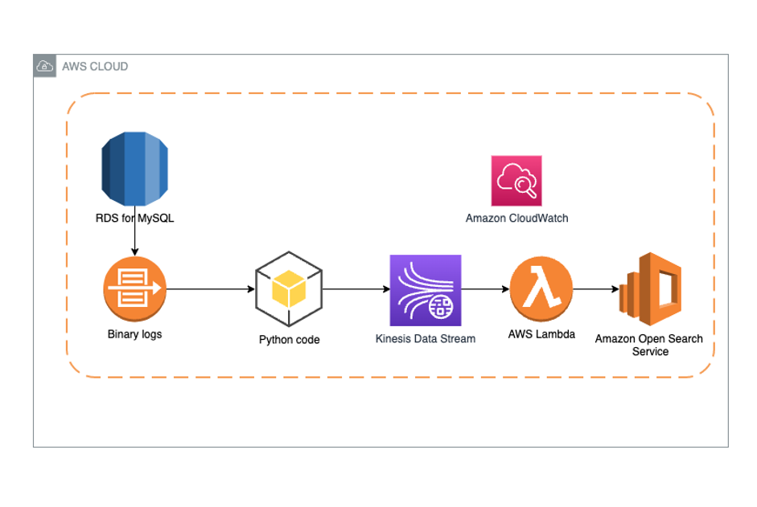

## Enable change data capture on RDS for MySQL applications that are using XA transactions

This repository describe a solution to safely replicate data with XA transactions from MySQL applications to Amazon OpenSearch Service using Amazon Kinesis Data Streams and AWS Lambda.

This repository contain 2 application 
1. mysql-cdc 
2. opensearch-writer 

###  mysql-cdc  
sample script that read data from MySQL binary logs and append the SQL data into Amazon Kinesis Data Stream

## Security

See [CONTRIBUTING](CONTRIBUTING.md#security-issue-notifications) for more information.

## License

This library is licensed under the MIT-0 License. See the LICENSE file.

